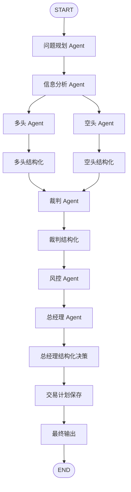

# Stock Decision System

基于 LangGraph 的股票市场多 Agent 决策系统。

## 目录

```text
main.py
requirements.txt
config.yaml
server.py
schemas/
  state.py
collectors/
  digital_oracle/
    providers/
  digital_oracle_collector.py
  connectors/
    equity.py
    china.py
    macro.py
    prediction.py
    crypto.py
    web_search.py
agents/
  skill_agent.py
  bull_agent.py
  bear_agent.py
  judge_agent.py
  risk_agent.py
graph/
  stock_graph.py
prompts/
  information_agent.md
  bull_agent.md
  bear_agent.md
  judge_agent.md
  risk_agent.md
  trader_agent.md
  portfolio_manager_agent.md
web/
  index.html
  styles.css
  app.js
```

## 前端页面

```powershell
pip install -r requirements.txt
python -m uvicorn server:app --host 127.0.0.1 --port 8000
```

打开：

```text
http://127.0.0.1:8000
```

页面支持输入股票代码和决策任务，并实时展示问题规划、信息分析、多头、空头、裁判、风控、总经理和交易计划报告。结构化多空、结构化裁判和结构化交易决策只作为内部图节点，不作为前端阶段输出。

## 命令行运行

```powershell
python main.py --config .\config.yaml --symbols AAPL,MSFT,NVDA --task "筛选未来 1-3 个月的候选股票"
```

## A 股自动购买流程

```powershell
python main.py `
  --config .\config.yaml `
  --mode a_share_daily `
  --task "扫描全市场，找出未来1个月最具投资价值的标的" `
  --risk-tolerance moderate `
  --capital 1000000
```

当总经理 Agent 给出 `BUY` 时，A 股图会写入 `data/trade_plan.json`。交易监控是独立程序化调度器：

```powershell
python -m schedulers.trade_monitor_scheduler `
  --config .\config.yaml `
  --plan-file data/trade_plan.json `
  --interval 60 `
  --mode SIMULATED
```

`SIMULATED` 会写入 `data/order_log.json`；`PAPER`/`LIVE` 接口保留但不会真实下单。

## OpenRouter

`config.yaml` 默认使用 OpenRouter：

```yaml
provider: openrouter
model: openai/gpt-5.2
api_key_env: OPENROUTER_API_KEY
```

如果没有 `.env`，可以手动设置：

```powershell
$env:OPENROUTER_API_KEY="你的 OpenRouter API Key"
```

## 流程



## 信息收集 Agent

信息收集默认使用：

```text
collectors/digital_oracle
```

不使用 Codex skill 扩展，也不需要配置 `skill_import_path`。项目把数据源 provider 包内置在 `collectors/digital_oracle`，统一由 `collectors/digital_oracle_collector.py` 调用 `collectors.digital_oracle` 中的 provider 方法采集数据，并把结果整理为：

- `raw_market_data`：结构化原始数据摘要
- `info_report`：给多头、空头、裁判 Agent 使用的 Markdown 信息报告

配置入口在 `config.yaml`：

```yaml
agents:
  information:
    collector:
      enabled: true
      timeout_seconds: 90
      price_history_limit: 90
      include_macro: true
      include_options: true
      include_edgar: true
      include_a_share_metrics: true
```

Provider 已按类别集中在 `collectors/connectors/`：

- `equity.py`：YahooPriceProvider、YFinanceProvider、EdgarProvider、StooqProvider
- `china.py`：TencentFinanceProvider、MootdxProvider
- `macro.py`：USTreasuryProvider、FearGreedProvider、CMEFedWatchProvider、CftcCotProvider、BisProvider、WorldBankProvider
- `prediction.py`：KalshiProvider、PolymarketProvider
- `crypto.py`：CoinGeckoProvider、DeribitProvider
- `web_search.py`：WebSearchProvider

默认采集能力：

- 美股/ETF：日 K、周 K、收益率、20 日波动率、成交量
- 美股期权：ATM IV、隐含波动区间、Put/Call、Max Pain
- SEC EDGAR：近期 Form 4 内部人交易申报
- 宏观：美债收益率曲线、Fear & Greed、CME FedWatch、CFTC COT、SPY、QQQ、VIX、黄金、USDCNY
- 预测市场：Kalshi、Polymarket
- 加密市场：CoinGecko、Deribit
- A 股：默认通过 TencentFinanceProvider 采集价格、PE、PB、市值、换手率等指标；Mootdx 可在 `config.yaml` 中开启
- 可选增强：BIS、WorldBank、WebSearch、Stooq 兼容价格源可在 `config.yaml` 中开启

如果某些数据源失败，信息收集 Agent 会保留成功来源，并把失败来源写入“数据缺口”。后续 Agent 必须把这些缺口当成不确定性处理。

## Agent 提示词

多头、空头、裁判、风控以及后续交易执行/组合管理 Agent 的提示词放在 `prompts/` 目录中。每个文件使用固定结构：

```markdown
## System

这里写 system prompt。

## User

这里写 user prompt，可使用 {task}、{candidates}、{info_report} 等变量。
```

Agent 初始化时会读取对应 `.md` 文件，运行时再填充 state 变量。修改提示词不需要改 Python 类。
# StockAgentWar

## Agent terminal trace

The project prints compact data-source logs to the terminal by default. The default trace includes:

- collector enabled status, timeout, worker count, and enabled provider groups
- data-source task plan
- per-source START / OK / FAIL status
- elapsed time and a short result summary
- exception type and message for failed sources

LLM prompts, LLM outputs, and agent-to-agent handoffs are quiet by default.

Controls:

```powershell
# Disable terminal trace
$env:AGENT_TRACE="0"

# Re-enable terminal trace
$env:AGENT_TRACE="1"

# Optional: show agent and LLM prompt/output trace
$env:AGENT_TRACE_AGENTS="1"

# Optional: show successful task-build logs
$env:AGENT_TRACE_TASK_BUILD="1"

# Optional: include Python tracebacks for failed sources
$env:AGENT_TRACE_TRACEBACK="1"
```

Logs are written to stderr, so API responses and CLI final output remain on stdout.
